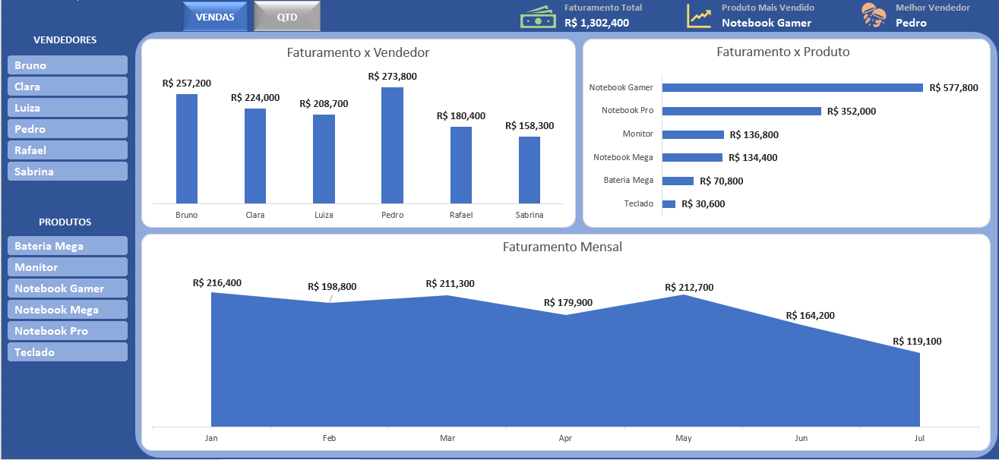

# Dashboard de Vendas em Excel

## 📌 Objetivo
Criar um dashboard interativo para análise de vendas, permitindo identificar faturamento e quantidade vendida por vendedor, produto e mês.

## 📊 Dados
Base fictícia de vendas contendo:
- Data
- Vendedor
- Produto
- Valor

## 🛠️ Ferramentas e técnicas utilizadas
- Tabelas dinâmicas
- Gráficos dinâmicos
- **SOMA**: obtendo resultado dos indicadores principais (KPIs)
- **INDICE e CORRESP**: obtendo resultado dos indicadores principais (KPIs)
- **PROCX**: obtendo resultado dos indicadores principais (KPIs)
- **MÁXIMO**: obtendo resultado dos indicadores principais (KPIs)

## 📈 Resultado
O dashboard final permite:
- Analisar faturamento total por vendedor, produto e mês
- Comparar faturamento entre vendedores e produtos
- Analisar o melhor vendedor e produto mais vendido
- Analisar total de vendas por vendedor, produto e mês

## 📺 Preview

