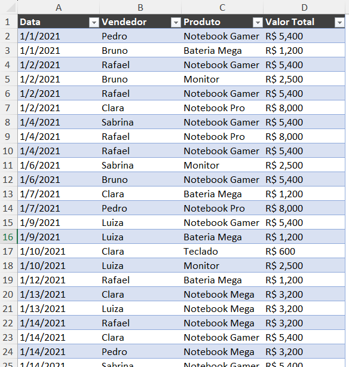
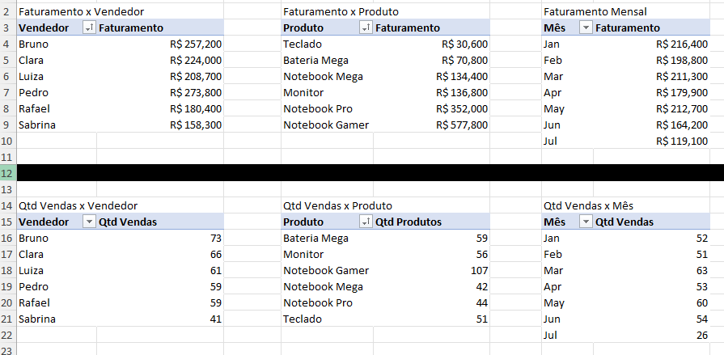

# Explicação das imagens

## Passo1
Base de vendas formatada como tabela

## Passo2
Tabelas dinâmicas criadas à partir da Base_de_Vendas. Na parte superior há somente tabelas dinâmicas de faturamento e na parte inferior tabelas dinâmicas de quantidades de vendas.

## Final_faturamento
Dashboard interativo que permite analisar faturamentos diversos por vendedor, produto e mês. Também é possível analisar faturamento total, produto que mais faturou e vendedor com o melhor faturamento.

## Final_qtd_vendas
Dashboard interativo que permite analisar quantidade total de vendas por vendedor, produto e mês. Também é possível analisar produto mais vendido e vendedor com maior quantidade de vendas.

