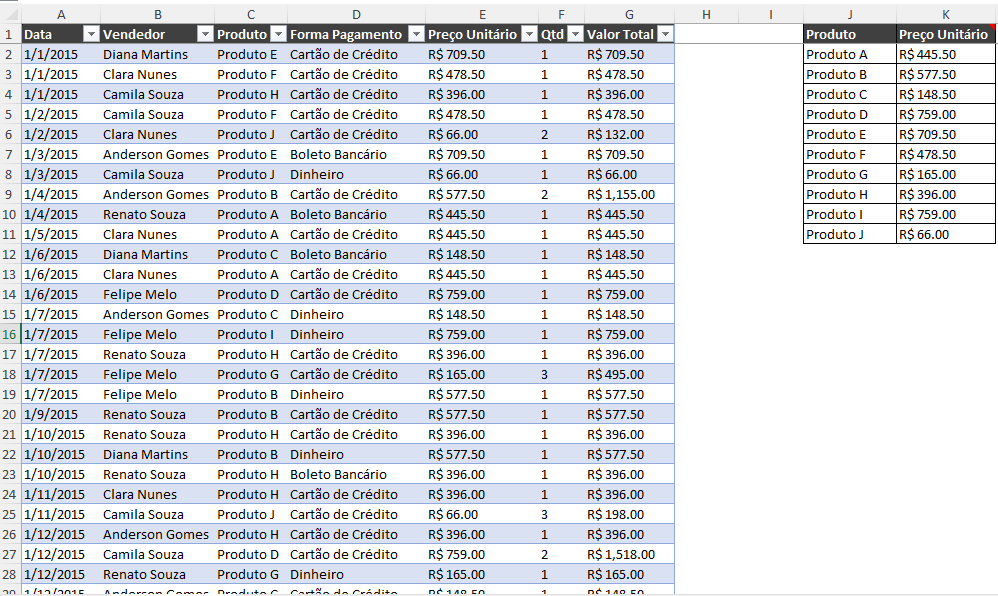
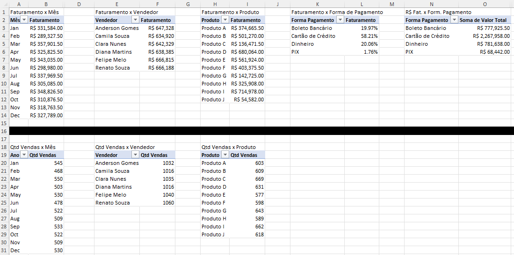
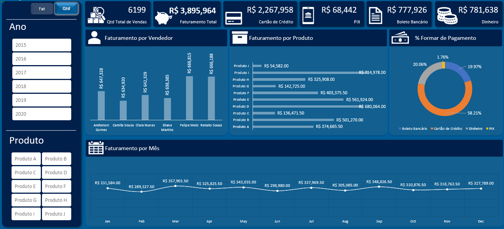

# Explicação das imagens

## Passo 1
Base de dados formatada como tabela. Na coluna **Preço Unitário** foi utilizado a função PROCV  para retornar o valor do produto utilizando como referência a mini-tabela das colunas J e K.

## Passo 2
Tabelas dinâmicas criadas à partir da tabela **Base_de_Vendas**. Na parte superior há tabelas dinâmicas de faturamento e na parte inferior somente tabelas dinâmicas de quantidade de vendas.

## Final_faturamento 
Dashboard interativo para análises diversas de faturamento por meses, anos, produtos e vendedores. O dashboard também permite visualizar a quantidade total de vendas, faturamento total e comparação de faturamento por formas de pagamento.

## Final_qtd_vendas
Dashboard interativo para análises diversas de quantidade total de vendas por meses, anos, produtos e vendedores. O dashboard também permite visualizar faturamento total e comparação de faturamento por formas de pagamento.
