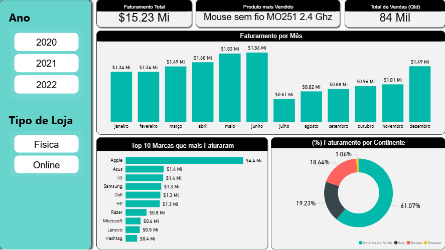

# Dashboard de Vendas em Power BI

## 📺 Preview

## 📌 Objetivo
Criar um dashboard interativo para analise de vendas, permitindo identificar faturamento mensal e anual, porcentagem de faturamento por continente e top 10 marcas com maiores faturamento.

## 📊 Dados
**Base fictícia de Clientes contendo:**
- Nome do Cliente
- Email
- Data de Nascimento
- Documento
- ID Cliente

**Base fictícia de Lojas contendo:**
- Nome da Loja
- Tipo de Loja
- Continente
- País
- Gerente
- Documento Gerente
- ID Loja

**Base fictícia de Produtos contendo:**
- Nome do Produto
- Marca
- Categoria
- Preço Unitário
- Custo Unitário
- SKU

**Bases fictícias de Vendas contendo:**
- Data da Venda
- Ordem de compra
- SKU
- ID Cliente
- ID Loja
- Quantidade

**Base fictícia de Devoluções contendo:**
- Data da Devolução
- ID Loja
- SKU
- Quantidade
- Motivo Devolução

## 🛠️ Ferramentas e Técnicas Utilizadas
Dentro do Power Query:
- **Gerenciar Parâmetros**: criando arquivo que contêm o caminho da pasta onde encontram-se todas as tabelas utilizadas
- Alteração de tipo das colunas
- Remoção de Colunas e Linhas em branco
- **Mesclar Colunas**: trazendo colunas da tabela dLocalidades para a tabela dLojas
- Substituir Valores
- Colunas de exemplo
- Separando colunas por delimitador
- **Combinar Arquivos**: juntando automaticamente todas as tabelas Base Vendas
- **Consulta Nula**: criando a tabela dCalendário utilizando como referência a coluna **Data da Venda** da planilha fVendas
- **Coluna Condicional**: criando a coluna Semestre utilizando como referência a coluna Mês

Dentro do Power BI:
- **Relacionamentos entre tabelas**: separando as tabelas entre dimensão (característica) e fato e criando os relacionamentos por meio de Chave Primária e Chave Estrangeira.
- **SUMX**: obtendo o faturamento total
- **AVERAGE**: calculando a idade média dos clientes
- **CALCULATE**: calculando a quantidade total de vendas de loja física e loja online
- **N Superior**: realizando filtragem pelas 10 marcas que mais Faturaram

## 📈 Resultado
O dashboard final permite: 
- Análise do faturamento mensal e anual
- Top 10 marcas que mais faturaram
- Análise da quantidade total de vendas
- Faturamento por tipo de loja (Física/Online)
- Análise percentual do faturamento por continente
- Produto mais vendido
