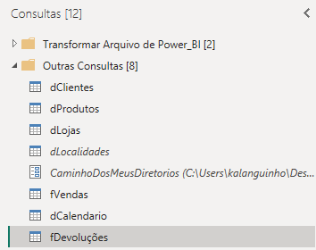
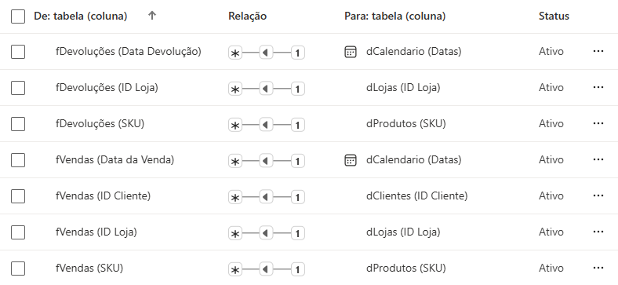

# Explicação das Imagens
## Passo 1
Todas as tabelas que foram utilizadas para criar o dashboard. Estão separadas entre tabelas dimensão (d) e tabelas fato (f). O arquivo "CaminhoDosMeusDiretorios" contém o local (pasta) onde encontram-se todas a planilhas. 

## Passo 2
Todos os relacionamentos criados entre as tabelas dimensão e as tabelas fato.

## Final
Dashboard interativo para análise de faturamento por mês, continente e top 10 Marcas que mais Faturaram. O dashboard também permite analisar o produto mais vendido, quantidade total de vendas e faturamento total. Além disso pode ser aplicado um filtro por ano e tipo de loja (física / online).

